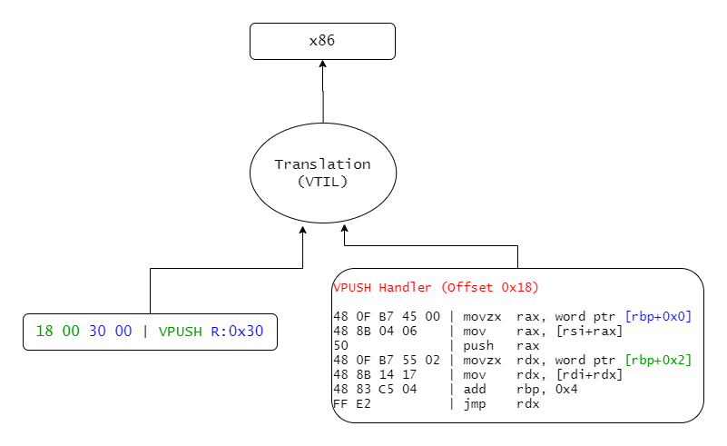

> This article is the result of my latest obsession with software virtualization. After years of just skipping virtualized routines, I was finally inspired by [Can](https://blog.can.ac/){:target="_blank"} and started work on this complex topic. What ensued was months of reverse engineering, functional programming, and a LOT of learning. Now that I finally feel comfortable publishing some information on the things I learned in the process, I present unto you the first installment in my devirtualization series, focusing on how virtualization works and the methodology of how we can lift a VM. The aim of this series is to tear down the curtains behind virtualization and hopefully inspire more reverse engineers to research this interesting topic!

## Preface

Over the last 10 years or so, virtualization based obfuscation has become the de-facto standard in defensive and offensive software alike. As the complexity and power of disassembling tools has improved, software security solutions have kept up rather well. Packers and code mutation tools, being easily defeated by even newbie attackers, have been replaced by these virtual machine based protectors. Today, the two main 'pioneers' in this field, controlling the vast majority of the market are [VMProtect](https://vmpsoft.com/){:target="_blank"} and [Themida](https://www.oreans.com/){:target="_blank"}. While we will be looking into analyzing (and breaking) them specifically in some future articles, today we'll just be looking into how we can lift *any* VM into [Can](https://blog.can.ac/){:target="_blank"}'s promising [VTIL](https://vtil.io/){:target="_blank"}.

## But first, what actually is virtualization?
Virtualization is the **recompilation** of instructions to a **custom propreitary architecture**, and the generation of **handler routines** to emulate said architecture. Let's look at an example of the life of just one simple instruction, `push rcx`:

|  |
|:--:|
| *The mystical adventure `push rcx` undertakes when you press 'Protect'* |

The `push rcx` instruction is decoded, and interpreted by the virtualizer. A handler is generated (or fetched, if it has already been generated and is being reused), which is responsible for executing this instruction in a way that the CPU understands. In our example, I called this handler `VPUSH` just for explanation's sake, but obviously they don't come with names attached to them. 

Following this, a 'virtual instruction' is then assembled, which contains bytes to identify its handler (in this case, just a table offset) and any operands that are needed for execution. You can see in the diagram above, that the bytes corresponding to the instruction's **handler offset** are in **green**, whereas the ones corresponding to the **operand** (ie. the **target register**) are in **blue**. This is also reflected in the handler with the corresponding colours.

It's worth noting, that on handler execution, the virtual instruction pointer (VIP) actually points to the beginning of the **blue** operand bytes. This is because the previous handler has to read (and consume) the next handler's offset in order to pass control over to it.

Anyways, let's take a closer look at this `VPUSH` handler:

```nasm
movzx ax, word ptr [rbp] 
; - rbp is the virtual instruction pointer (VIP) in this case, which contains the pushed register (blue)
; - the pushed register is fetched and stored in ax. In our case this is 0x30

mov rax, [rsi + rax] 
; - rsi is the virtual context; it holds each of the virtual registers. Think of a CONTEXT structure on 
; windows.
; - the lower word in rax holds the register offset in the context. The register is fetched from the
; context and stored in rax.

push rax
; - the stored register is pushed to the stack.

movzx rdx, word ptr [rbp+0x2]
mov rdx, [rdi+rdx]
; - VIP + 0x2 contains the next handler's offset (green). It is fetched and stored in rdx
; - rdi is the handler table base. The next handler is fetched by offseting it by rdx and storing the
; handler address

add rbp, 0x4
; - the instruction pointer is incremented by the size of bytes consumed

jmp rdx
; - jump to the next handler, held by rdx, to execute the next instruction's handler
; - the execution loop continues...
```

Virtual machines are basically just very **very** long chains of these handlers, each doing quite rudimentary operations.
It must be said, however, that the example I gave above is an extremely simple one. Modern virtualizers have integrated encryption and obfuscation techniques, and some feature quite advanced custom architectures. Many stray far away from the x86 instruction set to make the analyst's life harder.

Well, how does this impact analysis, you ask? Well, since you're reading this article, you must already know ;)
But to name a few:
- The original instructions are lost, forever. Only the behaviour is retained, in a propreitary, usually randomized architecture. For example, even after full devirtualization, we can't for 100% say that the original register used for the push is `rcx`.
- The VM's architecture can differ significantly from the original. For example, a single VM instruction could push 3 registers, exchange 2 registers, and write to one register. All in a *single* virtual instruction!
- Other obfuscation techniques (such as mutation) can now be applied on both the host level (real x86 instructions executing on the PC) and on the guest level (the virtual instructions represented by the handlers).
- Control flow is in most cases highly obscured. Often conditional jumps are manually emulated. This makes tracking basic blocks difficult.
- The VM cannot be statically analyzed in tools like IDA, as it does not function like a conventional program.

Needless to say, virtualization is an extremely powerful and effective software protection method. 

## Let's break it!
In order to break and reverse this protection, we really just need to do three things: gather information in order to determine exactly what each handler does in which order, somehow convert this information into a language that the CPU and disassemblers understand (in our case, x86), and then finally repackage the binary.
This is called *lifting*, *translation*, and *repackaging* respectively, and it is what needs to be done to devirtualize any VM.
Today, we're just gonna be looking at *lifting* in particular.

## Lifting
The dictionary definition for lifting is "raise to a higher position or level". This is entirely true. We are performing analyis on the virtual routines, in order to determine what each handler does on the instruction level, and then converting this information into a higher level, easy-to-understand representation. This is done in a few steps.

### Navigation

|  |
|:--:|
| *After analyzing VMs for a few hours (or days), you do begin to notice certain things.* |

Before we can perform any handler analysis, we must first be able to navigate our way around the VM. Although this step varies greatly for each VM, certain parts always remain the same.
- Every VM routine must begin by saving the value of each register, usually by pushing them to the stack. This is done because the VM needs to use the registers to run its handlers, and it must restore the registers after exiting the VM.
- Each VM must also have some sort of context structure. This is where current executing information about the VM is held, such as register values. It can easily be identified as it is accessed very often in every handler.
- Each VM must have an instruction pointer (VIP) used to determine which handler to execute next and to provide that handler with operands. It is also easy to identify, as it much be adjusted after each handler.
- Many VMs have some sort of stack representation. For example, VMProtect uses a nominated register to access the stack, whereas Themida just uses RSP.
- Code flow must somehow be passed from one handler to the next. This can just be an index in a handler table, an offset to some point in the code, or something entirely different. It is worth noting that the next handler *must* be computed from the VIP.

In order to properly analyze and decode each handler, we must be able to follow the VM's execution. We must follow the VM's *fetch->decode->execute* loop, so we are able to determine which handler will be executed next. Once the basics of the VM are reversed and we can step through the handler instructions, the next step is to identify these handlers.

### Identification
Now we need to determine what each handler does. We can achieve this via *pattern matching* the instructions. Of course, we must remember to keep these patterns balanced, ensuring we match all the relevant instructions but make them generic enough so that we can match with all instances of the handler.

*Pattern matching* is quite a generic method, and can be used in various different flavours alongside many other algorithms depending on the complexity of the VM. But in this example we're gonna take it easy, and just look at a simple forward matching algorithm. This allows us to specify the patterns we want to match, and the order we want to match them in.

Let's use the above `push` handler as an example:

```c++
// this class contains templates to pattern match against
//
auto matcher = new pattern_matcher(stream);

// these are the constant registers
// they are hardcoded here for simplicity's sake
//
x86_reg vip_reg = X86_REG_RBP;
x86_reg vcontext_reg = X86_REG_RSI;

// these values will be set as the patterns are found
// they allow us to ensure that the same register is used for more than one pattern
// they also allow us to retrieve specific information about the handler eg. operand sizes
//
x86_reg pushed_reg_idx_reg = X86_REG_INVALID;
uint64_t pushed_reg_idx_offs = -1;

x86_reg pushed_reg = X86_REG_INVALID;
 
auto result = matcher
    // match for `mov %0, [%vip + %1]`
    // %0 is written to pushed_reg_idx_reg, %1 is written to pushed_reg_idx_offs
    //
    ->mov_reg_mem(&pushed_reg_idx_reg, &vip_reg, &pushed_reg_idx_offs)

    // match for `mov %2, [%ctx + %0]`
    // %2 is written to pushed_reg
    //
    ->mov_reg_mem_idx(&pushed_reg, &vcontext_reg, &pushed_reg_idx)
    
    // match for `push %2`
    //
    ->push_reg(&pushed_reg)

if (result)
    // matched - the handler is `push`
else
    // not matched - the handler is something else
```

Using this approach, by keeping a table of handlers with their corresponding patterns, we can match and identify each instruction stream with their handler. We can also scrape some information about the handler instances, such as the operand sizes. This will come in useful in the next step.

#### Generation

Okay, so now we can walk through VM routines, identify their handlers and analyze them for information. So for all intents and purposes, the *lifting* phase is complete. But if you recall, our final goal is x86. The process our scraped information needs to go through now to produce readable x86 instructions is called *translation*. This is converting the 'instructions' we have just lifted into a different architecture, in our case x86.

This is actually a really difficult task to accomplish. Like I previously mentioned, virtualization is a descructive process. Data gets lost in the transition, which must be somehow recovered. This leads to a ton of complications:
- Some virtualizer architectures can purposely omit certain instructions and replace them with other functional equivalents. This means that a pretty x86 `sub` can turn in to a bunch of bitwise operations.
- VM architectures can be really diverse. They can be RISC, CISC, and/or stack machines. They can have 8, 16, or 100 registers. All of these 'features' need to be generalized, and converted back into the often significantly different x86 architecture.
- Conditional jumps can be manually emulated by these VM architectures. This makes retrieving basic block addresses a challenge, and reconstructing the original jump instruction an even bigger challenge. For example, [an x86 `jbe` can easily become hundreds of virtual instructions](https://blog.can.ac/2020/04/11/writing-an-optimizing-il-compiler-for-dummies-by-a-dummy/){:target="_blank"}. 
- Compiler frameworks like [LLVM](https://llvm.org/){:target="_blank"} were not made for this task, so we don't get much fine-grained control over things like registers or flags, which is nessecary for full devirtualization.

So until now, ambitious reverse engineers were forced to come up with their own solutions to this problem. That's about to change with [VTIL](https://vtil.io/){:target="_blank"}.

|  |
|:--:|
| *So... How are we supposed to go back to x86? VTIL!* |

The Virtual Translation Intermediate Language (VTIL) is a work-in-progress **intermediate language** who's primary focus is just that: translation. That means that it's a fully-fledged assembly-like language into which VM routines can easily be lifted into. Once lifted, VTIL takes care of all the optimization and compilation to produce sexy x86 instructions. 

Believe it or not, generating VTIL instructions from decoded handlers is actually really simple - in fact, implementing a full VTIL generator for my VMProtect lifter took me less than 2 days! Now this article isn't supposed to be a documentation for VTIL, so we're gonna keep this *very* simple. If you'd like to learn more about the project, I'd suggest visiting the [GitHub](https://github.com/vtil-project){:target="_blank"}.

So, without further adieu, let's generate some VTIL for that `push` instruction! 

First, we define a basic block:

```cpp
// block_vip is just something to identify the block.
// you can use the relative or absolute VIP of the block's first instruction.
//
auto block = vtil::basic_block::begin(block_vip);
```

This creates a basic block and routine, and automatically appends the created basic block to said routine.

Now let's push our scraped register onto the stack:

```cpp
// the following instruction defines a register. In VTIL, we can define as many registers as we want.
//
// - vtil::register_virtual means that the register is virtual ie. it is only existent in the VM context
// - we get the register id via reg_offs / 8, as in our example VM all registers are 8-byte aligned. This
// won't always be the case.
// - 64 specifies the register's size. For our example, the register is always 64 bits.
// - next, we get the bit offst by getting the modulus of our register offset
//
vtil::register_desc reg(vtil::register_virtual, 64, reg_size * 8, (reg_offs % 8) * 8);

// quite self explanatory :^)
// note that in VTIL, we can chain these calls for that super clean look!
//
block->push(reg);
```

And finally let's use dump our precious little routine:

```cpp
vtil::debug::dump(block->owner);
```

|  |
|:--:|
| *The instruction we just lifted in all its colourful glory!* |

Wow! How beautiful!

The instruction that's *actually* emitted is a `str` (read: "store") instruction, which (you guessed it) stores our '0x30' register (called `vr6`) at `$sp + 0x8`. Easy!

## Conslusion

To many reverse engineers, virtualization software protection is an enormous roadblock in analysis. Many are quickly demotivated by the complexity of the topic or lack of public information available. This article, and this series, is meant to change that, and prove that **virtualization CAN be analyzed and reversed**, and is not something that you, as a reverse engineer, should avoid or hide from. Tackle it head on! It's not as difficult as you might think! 

*This has been my first (ever) article, I hope you enjoyed reading it! I'd love to hear any feedback or critisism - tweet or DM me on [Twitter](https://twitter.com/_0xnobody_){:target="_blank"}!*

*PS. If you're interested in understanding how VTIL does its magic, or just like reading interesting articles, I highly recommend [Can's blog](https://blog.can.ac/){:target="_blank"}!*